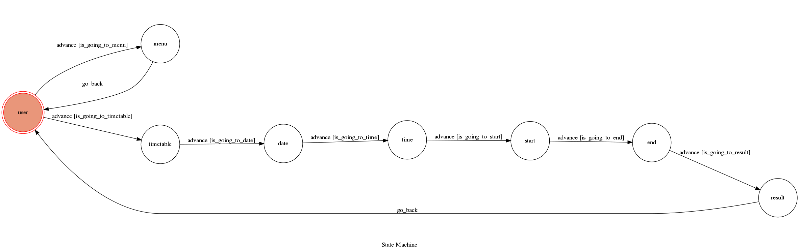

# Line Chatbot

Theory of Computation class final project

A Line bot based on a finite state machine

## Setup

### Prerequisite
* Python 3
* Pipenv
* Facebook Page and App
* HTTPS Server


#### Install Dependency
```sh
pip3 install pipenv

pipenv --three

pipenv install

pipenv shell
```

* pygraphviz (For visualizing Finite State Machine)

* beautifulsoup4 (For parse website data)

## Feature
* deploy on Heroku
* parse data from [台灣高鐵](http://www.thsrc.com.tw/index.html)

## Finite State Machine


## Usage
The initial state is set to `user`.

`user` state is triggered to `advance` to another state, and it will `go_back` to user `state` or go to other state after the bot replies corresponding message.

* user
	* Input: "嗨"
		* Go to `menu`

	* Input: "查詢"
		* Go to `timetable`
* menu
	* Reply:"我是高鐵服務機器人！\n我可以查詢高鐵時刻表~\n請輸入 : 查詢"
	* Go back to `user`

* timetable
    * Reply: "請問你要幾號搭車呢？\n輸入格式為:YYYY/MM/DD"
	* Input: "yyyy/mm/dd"(ex:2019/12/05)
        * Go to `date`

* date
    * Reply: "好的，搭車日期為： yyyy/mm/dd\n那你要幾點出發呢？輸入格式為\nhh:mm"
	* Input: "hh:mm"(ex:09:00)
		* Go to `time`
		
* time
    * Reply: "好的，搭車時間為: hh:mm\n那你要從哪一站出發呢"
    *  Input: "台北"(ex:台北出發)
		* Go to `start`
		
* start
    * Reply: "好的，出發車站為:台北\n那你要搭到哪一站呢？"
	* Input: "台南"(ex:搭到台南)
		* Go to `end`
		
* end
    * Reply: "好的，抵達車站為:台南\n以上搭車資訊是否正確?
	* Input: "是"
	    * Go to `result`
* result
    * Reply:"出發 - 到達（行駛時間）\n09:01 - 10:47 ( 01:46 )...\n繼續查詢，請輸入: 查詢\n\n官網:http://www.thsrc.com.tw/index.html"
    *  Go back to `user`


## Reference
* [Pipenv](https://medium.com/@chihsuan/pipenv-更簡單-更快速的-python-套件管理工具-135a47e504f4) ❤️ [@chihsuan](https://github.com/chihsuan)

* [TOC-Project-2019](https://github.com/winonecheng/TOC-Project-2019) ❤️ [@winonecheng](https://github.com/winonecheng)

* Flask Architecture ❤️ [@Sirius207](https://github.com/Sirius207)

* [Line line-bot-sdk-python](https://github.com/line/line-bot-sdk-python/tree/master/examples/flask-echo)
* [台灣高鐵](http://www.thsrc.com.tw/index.html)
* [Heroku](https://www.heroku.com/)

